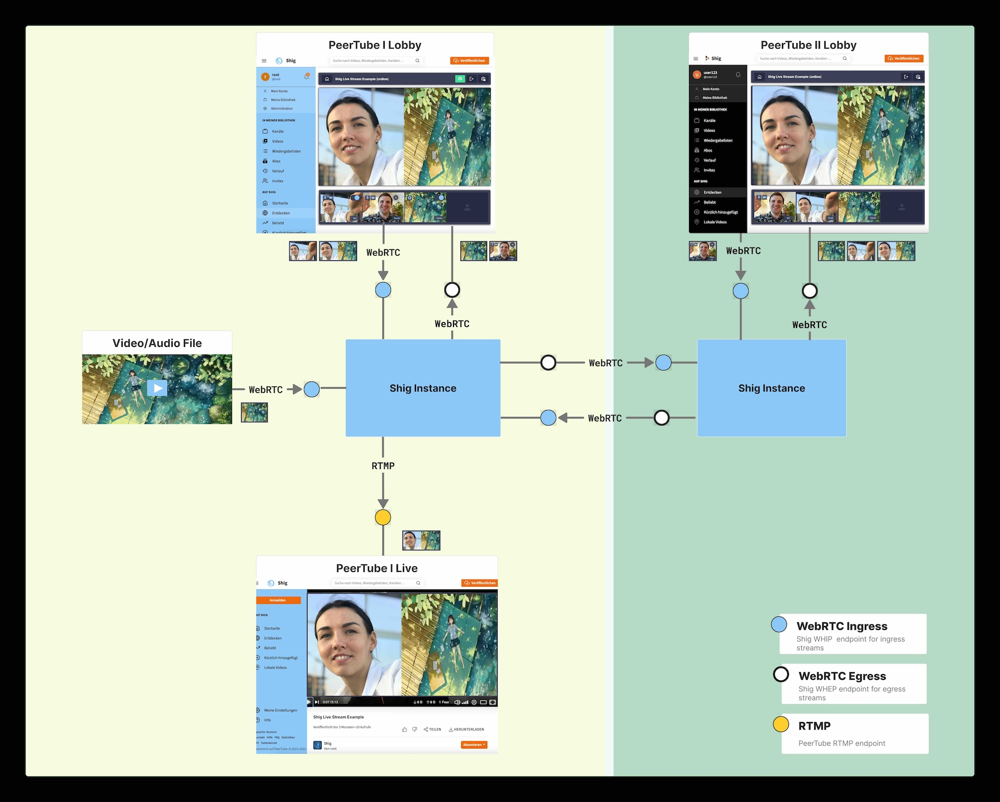

# Shig Instance

Shig is a federated service designed to distribute and replicate live streams among Fediverse instances. 
It's built upon the WHIP/WHEP approach for both inbound and outbound streams.
Through an ActivityPub integration, Shig can follow other Fediverse services and receive updates on live stream activities.



## Features

| Feature                  |                          | Develop State | Release |
|--------------------------|--------------------------|---------------|---------|
| **Endpoints**            |                          |               |         |
|                          | WHIP/WHEP (Lobby)        | finish        |         |
|                          | WHIP/WHEP (Instances)    | testing       |         |
|                          | WHIP/WHEP (Static Files) | develop       |         |
|                          | Mute/Unmute              | testing       |         |
|                          | WebRTC to RTMP           | develop       |         |
|                          | WebRTC to HLS            | planned       |         |
| **Bandwidth Estimation** |                          |               |         |
|                          | Receiver/Sender Reports  | planned       |         |
|                          | Simulcast                | planned       |         |
|                          | FEC                      | planned       |         |
| **Activity Pub**         |                          |               |         |
|                          | Fallow PeerTube          | finish        |         |
|                          | Fallow Channel           | finish        |         |
|                          | Fallow Shig Instance     | planned       |         |
|                          | Fallow Remote PeerTube   | testing       |         |
|                          | OAuth between Services   | planned       |         |
| **Deployment**           |                          |               |         |
|                          | Docker                   | planned       |         |

**Develop States**: planed | develop | testing | finish

## Documentaion

- [Use Cases](docs/use-cases.md)
- [Entities](docs/entities.md)
- [Architecture](docs/architecture.md)
- [WHIP/WHEP: Lobby Session initialization](docs/whip-whep.md)
- [ShigCLT: Start stream via commandline tool](docs/cli.md)
- [Backpressure](docs/backpressure.md)

## Quick Start

### Run Shig Instance

```shell
make run
```

### Run with some Data

Normally, the SFU (Shig instance) listens for data from other Fediverse instances.
However, to facilitate development, you could start the SFU with an included SQLite database.
Run inside the SFU project

```shell
mv shig-dev.db shig.db
```

Now you can start the SFU with some data.

## Build

```shell
make build
``` 

#### Build Docker Container for Shig Instance

```shell
make build-container
``` 

### Build with Docker

```shell
make docker-build
```

#### Build Docker Container for Shig Instance

```shell
make docker-build-container
```

## Build Shig CLT

```shell
export DOCKER_DEFAULT_PLATFORM=linux/amd64
docker run --rm -v "$PWD":/usr/src/myapp -w /usr/src/myapp shig-builder make build-clt-linux
```

## Monitoring

### Requirement

please install grafana loki docker plugin

```shell
docker plugin install grafana/loki-docker-driver:latest --alias loki --grant-all-permissions
```

### Start Develop Monitoring

```shell
make monitor
```

### Funded by

<p style="display: flex; flex-direction: row; justify-content: flex-start; align-items: center;">
<a href="https://www.bmbf.de/bmbf/en" rel="nofollow"></a>&nbsp; &nbsp; &nbsp; &nbsp; &nbsp; &nbsp; <a href="https://prototypefund.de/en/" rel="nofollow"></a>&nbsp; &nbsp; &nbsp; &nbsp; &nbsp; &nbsp; <a href="https://okfn.de/en/" rel="nofollow"></a>
</p>
