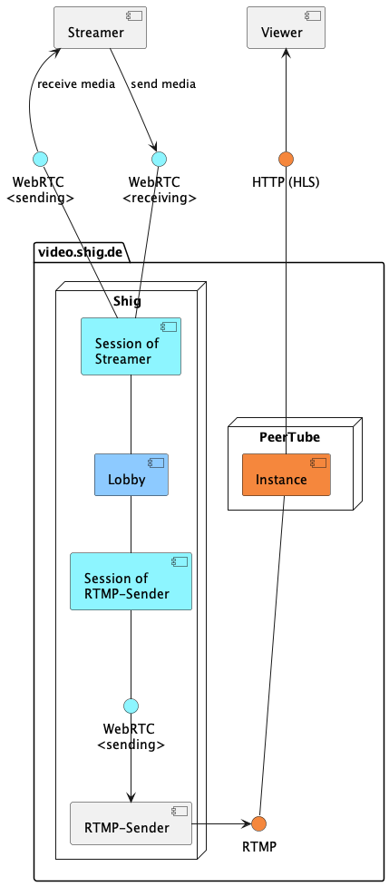
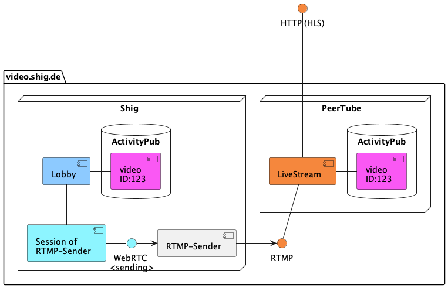
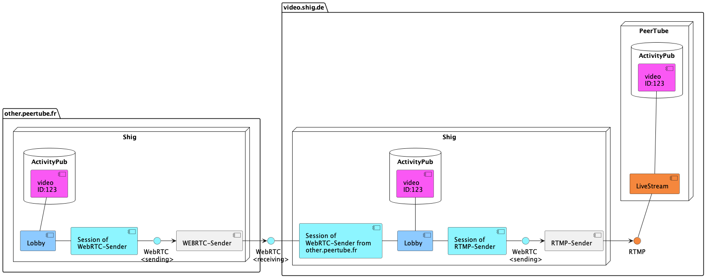

# Architecture

## Shig Lobby 

From a broad perspective, Shig is a service that enables you to establish a video conference and stream it using RTMP or other protocols. 
In this type of conference, each participant creates a Lobby Session, which includes both one incoming and one outgoing WebRTC endpoint. 
It's worth noting that a participant doesn't necessarily have to be a person. 
In the example below, a participant can simply be an RTMP service connected exclusively to the outgoing WebRTC endpoint of its session.

)

There are only a few essential nuances here. 
Setting up a Lobby Session is done through WHIP/WHEP, and furthermore, Shig eliminates the need for an additional signaling and metadata layer via WebSocket.

Because metadata creates states that tend to be persists in the Lobby in the Client in the Sender or somewhere else.
In essence, the goal is to avoid an additional metadata data flow for Mute, Ice Restart and so on, alongside the video media stream.
Shig utilizes various techniques to tightly integrate this metadata flow with the video stream.
If we achieve this, we can reach interconnected media stream pipes through the Lobby Session without having to worry about the meta state of this video stream.

This would form the foundation for additional features like scaling live streams across federative instance borders.

## ActivityPub
Shig has an ActivityPub integration and follows the Peertube instance.
When live videos are created in PeerTube, Shig becomes aware of them. 
Subsequently, Shig fetches the actors of the respective live video participants from the PeerTube instance. 
This enables Shig to manage Lobby access rights.

)

## Scaling live streams across federative instances

Description coming soon

