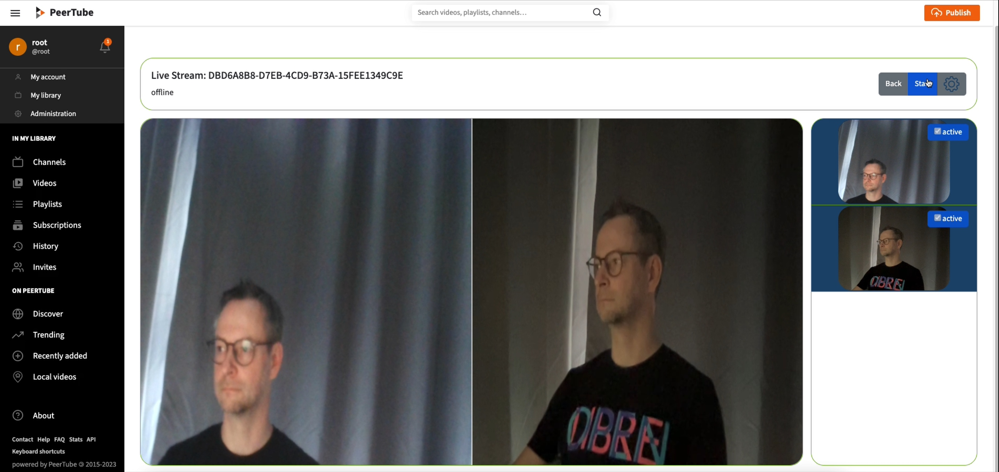
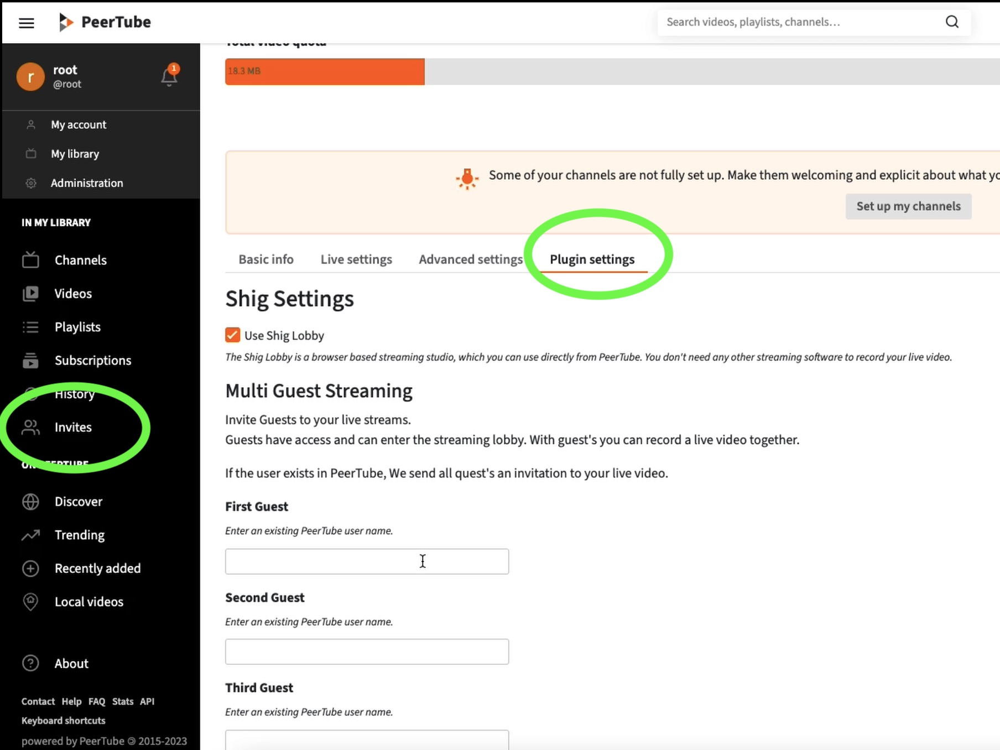
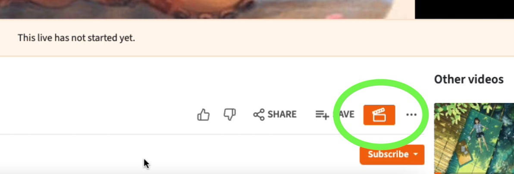
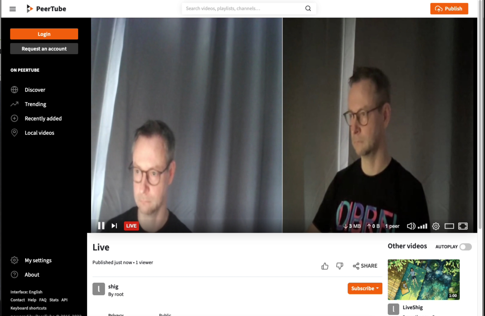

# Use Cases

## Embedded Streaming
Shig enables livestreaming directly from PeerTube without the need to configure OBS or transfer streaming secret keys to another software.
There is a [Shig PeerTube plugin](https://github.com/shigde/peertube-plugin-shig-live-stream) for this purpose.
The following image displays the Shig lobby (currently still raw).
The lobby  is embedded in PeerTube  and allows to control which streams are presented live.

With the plugin, a Shig service Instance can be registered. 
This allowing Shig to call the Instance Actor and follow the instance.

Since both PeerTube and Shig have ActivityPub integration, Shig can retrieve information about the peerTube instance and  live videos.
This enables embedded streaming, meaning no other software is necessary.

## Multi Guest Streaming

I did a video to demonstrate Multi Guest Streaming: https://video.shig.de/w/j8ZuLoCuJEkReuUWoy9g5d

With the [Shig PeerTube plugin](https://github.com/shigde/peertube-plugin-shig-live-stream) it is possible to invite other PeerTube users to join your stream.
The plugin provides a dedicated live stream setting for this purpose.
The plugin also extends PeerTube with a new submenu for invitations to streams notifications.
Furthermore, the lobby can be opened through a button that appears in the video menu."

Last image shows a live stream with guest

## Cloning Live Streams across federate instances

### Fediverse based on Trust

One of the fundamental ideas of the Fediverse is trust. 
That´s mean you select a Fediverse instance provider, and the content is delivered to you in a way that keeps your private data exclusively with that provider. 

### Privacy vs. Distribution Load
With ActivityPub, it's possible to clone the ActivityPub data of video and live stream from one instance to another.
However, the real video files and live streams need to be cloned between the servers using a different technique.

The use of server-side technologies enables the keeping of user information private. 
To distribute videos between instances, one can use WebSeed with BitTorrent, maybe IPFS as well.  

However, there is always a balance between performance and data privacy. 
This is where browser based P2P WebRTC technologies come into play. 
For example the [P2P Media Loader](https://github.com/Novage/p2p-media-loader).
This allows to shift the distribution load onto the clients.
The major drawback of this approach is that viewers has to one has to disclose both their public and private IP addresses.
This goes against the principles of the Fediverse.

### No privacy for realtime live streams in Fediverse
Realtime live streams currently cannot be cloned between Fediverse instances server-side. 

To share Live streams there are  approaches based on browser-based P2P. 
One can also use a Live Stream CDN and link it with other instances. 
However, even in this case, viewer have to depart from there Fediverse provider to consume the stream. 
Or at the very least, the viewer IP will be disclosed to the external provider via http redirect. 
The combination of IP and ActivityPub ID then compromises my privacy.

Shig is attempting to do just that.
Cloning Live streams via WebRTC server based.

### Content Scaling vs. User Scaling
In the Fediverse an instance administrator should only be responsible for their own users and viewers. 
Currently, if there is a streamer on the instance with many followers, the viewers have to come to that instance.
This will increase the outgoing traffic of that instance. That's not really fair.

With Shig, each viewer from a different instance would generate an outgoing upstream to that instance. 
However, it would be only one upstream to that instance, and each additional viewer from the other instance would consume that same upstream.

For the other instance, incoming traffic is not inexpensive. 
In general outgoing traffic usually incurs costs. 
However, the incoming upstream naturally generates additional CPU usage. 
Nevertheless, it would be more fair because the number of incoming upstreams depends on the number of instance users.

Furthermore, in order to save hosting costs, Shig is intended to operate as a runner that is only activated when needed.
This means in the future, Shig will start only when an upstream is needed.

## Monetization via trusted Video AdServer

If there's the capability to clone live streams, one can deliver live video advertising without an ad server having the ability to track users.
In doing so, the advertising would need to adapt to the specific conditions of the Fediverse, as users in the Fediverse have more options and rights.

### Special roles in Fediverse
The network Fediverse of independent instances that exchange videos, texts, and messages among each other. 
Each individual instance is managed by an operator who has a fundamental interest in monetizing content. 
However, the decision-making and ownership structures of the involved groups in the Fediverse are somewhat more complex as in central systems:

- Instance operators determine which monetization service can deliver advertising content.
- Video creators determine how and how much advertising content is displayed.
- Video consumers decide which content they can access even when advertising is displayed.
- Advertisers decide where their ads should be delivered.
- The monetization service decides which instances to add to its delivery network.

It should be assumed that of the five different groups, only consumers have no interest in monetization. 
Therefore, it should be considered how much advertising disrupts the consumption of videos and live streams:

- The advertising video plays in a popup in the corner and is dismissible.
- The advertising video plays embedded in a corner of the main video and is not dismissible.
- The advertising displaces the video.
