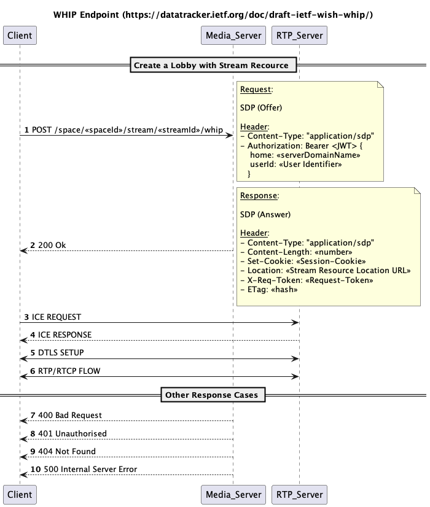
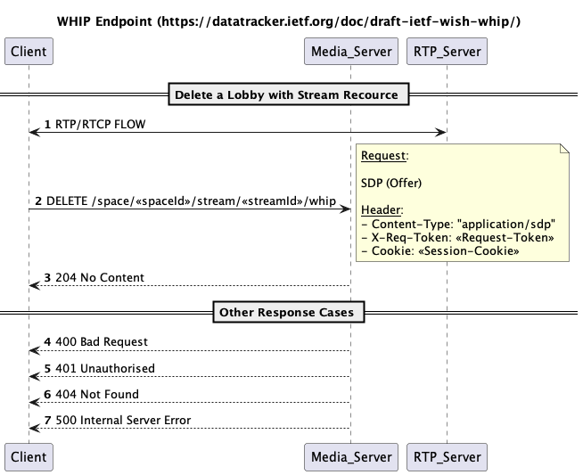
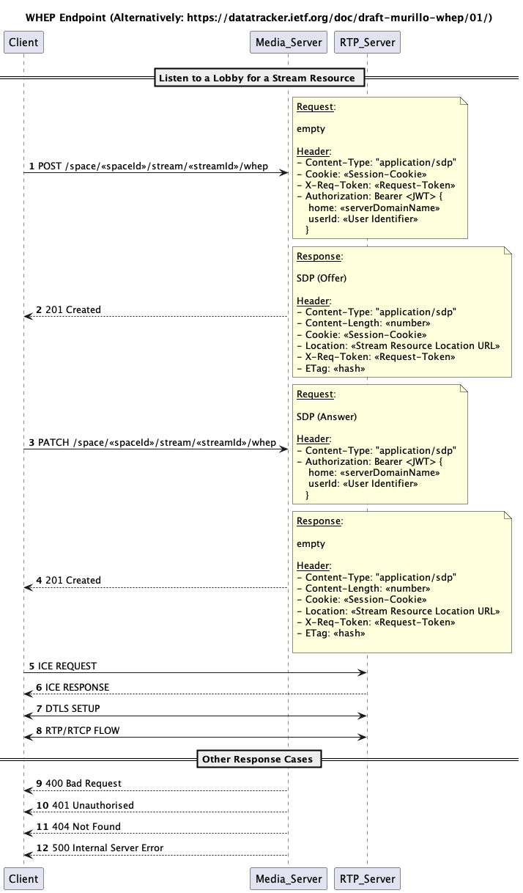
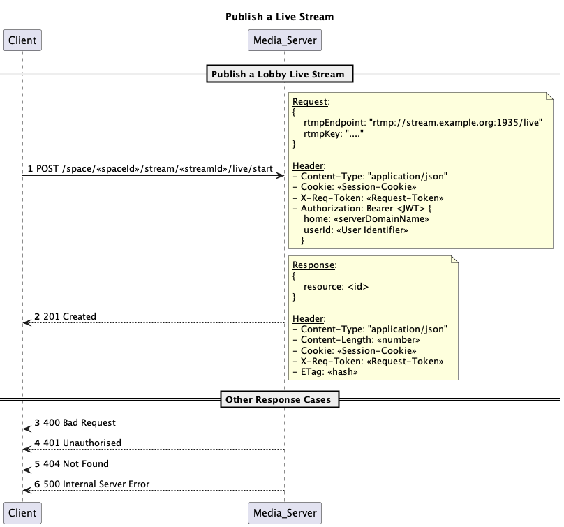
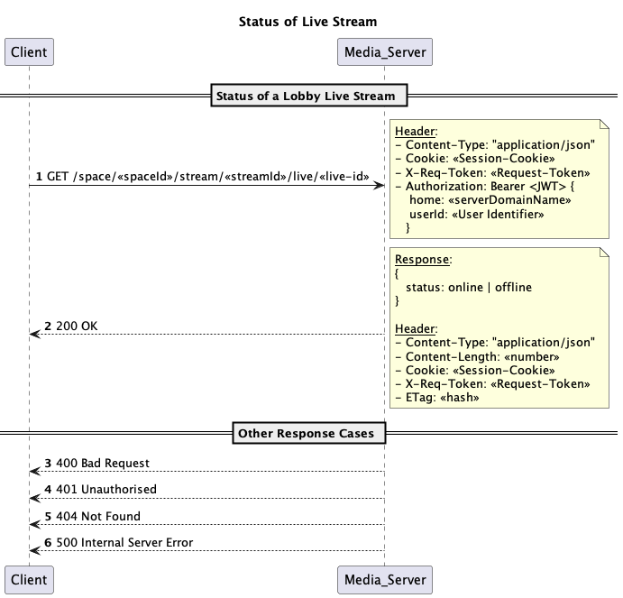
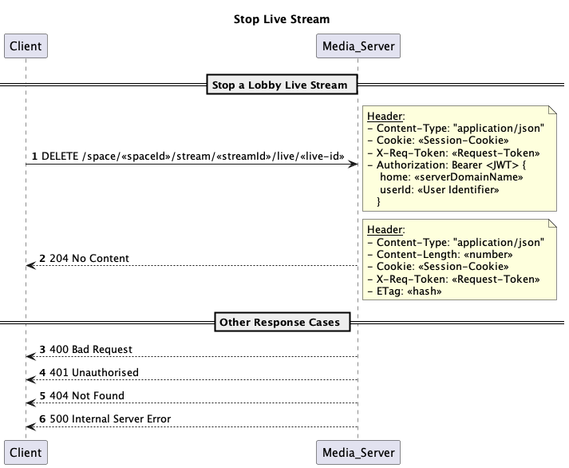

# WHIP/WHEP Lobby Session initialization

## Lobby Streaming Workflow

### Create a Lobby Session and send Video/Audio + Signal Channel
To create a Lobby Session, you need to send an HTTP (POST) request with an Authentication Token included in the request header.
Within the Lobby Session, you will establish a Media Endpoint for publishing your streaming audio and video content.
You must include a Session Description Offer with the necessary Media Metadata in the payload to create a video or audio stream.

In response, the server will provide an SDP Answer.
Additionally, the server will send a session cookie that represents the Media Resource.

#### Signal Channel
With a WHIP request, a data channel is simultaneously established.
This data channel enables signaling, offering the client vital information regarding the addition or removal of external tracks from the lobby.
This functionality is crucial if the client intends to send a WHEP request to receive media data.

### Delete a Lobby Session
You cannot update your Lobby Session since a Lobby Session is statefully unique.
If you wish to change your transmitting devices, you must delete your initial session and create a new one.
This trade-off is one we accept to simplify and eliminate unnecessary signaling logic.

### Listen a Lobby Session and receive Video/Audio

The client initiates a POST request to request a WebRTC resource.
Subsequently, the server creates a WebRTC endpoint and replies with an SDP offer.
The client, in response, submits a PATCH request along with its own SDP answer.

#### Signaling
To consume media, you initially require a WHIP connection.
It's important to note that no media needs to be transmitted.
However, when establishing the WHIP connection, a DataChannel is also created, and this data channel serves as the signaling endpoint.
When new tracks are added to the lobby, the server dispatches SDP offers through this endpoint.
This enables the client to refresh its WHEP connection and transmit an SDP response via the same data channel.

### Publish/Stop/Status Lobby Session

A Lobby Session can only be made live with the assistance of a session cookie.
This session cookie represents a Lobby session and is obtained when you create a WHIP request.

